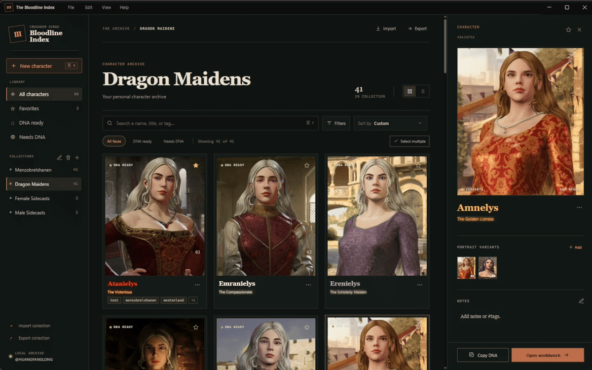

# CK3 Character Gallery

[](https://github.com/huangfanglong/CK3-Character-Gallery/actions/workflows/ci.yml)



CK3 Character Gallery is a local desktop archive for Crusader Kings III character DNA and portraits. I use it to keep faces, DNA strings, tags, and reference notes together instead of digging through screenshots and text files later.

Version 3 is currently an Electron with a portrait-first archive. The v2 Python/Tkinter application is preserved on the `archive/v2` branch.

## What's New in 3.1

### Live CK3 Portraits

Open a character's Manage Record dialog and choose **Capture live portrait** to record a visible Crusader Kings III window directly into that character's portrait variants. Keep CK3 unobscured, borderless or windowed mode might work best but I used fullscreen just fine.

Choose the CK3 window, position the square frame around the portrait, and press the recording hotkey in CK3. The default is `Ctrl+Alt+G`, alternatively several other preset hotkeys can be chosen before recording. Captures are saved as 450 x 450 animated WebM portraits at 30 FPS, with a maximum recording time of 25 seconds.

An overlay will appear inside CK3 along with a sound notification effect to let you know when the recording starts, ends, or is in smooth loop searching mode.

When you stop recording, Smart Loop can keep looking for a smoother point where the animation can return to its first frame so that it doesn't look abrupt or unsightly each time it returns to the 1st frame in a collection/gallery with multiple animated portraits. Set the Smooth Loop Search from 1 to 25 seconds. Press the recording hotkey a second time while it is matching to finish immediately.

Animated GIF portraits can also be imported alongside still images. Animated WebM cards play while they are visible, cards outside the viewport will be paused for optimization sake.

Note: If you are going to use animated portraits for a large collection expect to budget out disk space accordingly.

## Run v3

You need Node.js 22.12 or newer.

Opens the Electron app directly from the repository:
```bash
npm install
npm run dev
```

Or produce an executable:

Unpacked:
```bash
npm run package:win:dir
```

Packed:
```bash
npm ci --include=dev
npm test
npm run package:win
```

Output is written to `release/`.

## Basic Usage

1. Create a character with `Ctrl+N`, or click the `+ New character` button, or just copy an image you have then `Ctrl+V` and it will prompt you to create a new character with that image, or if you have a valid CK3 DNA string (the full Persistent DNA or DNA string) copied you can also `Ctrl+V` in the app and it will prompt you to create a new character with that DNA.
2. If you created a character card with just a portrait photo, you can then select that character card in the app, then go and copy the DNA string to your clipboard and `Ctrl+V` it in the app, it will add the DNA to that character card.
3. Likewise if you created a character card with just a DNA string, you can copy an img and `Ctrl+V` it in the app with the card selected and it will add the portrait img to that character card.
4. Easy repositioning by drag-and-drop, or sort it.
6. Just play around with it. I have tried to make it convenient and intuitive to use as I play the game and use it at the same time.

- A character can hold up to five portraits. Selecting a thumbnail in the inspector changes the large preview. The arrows on a character card choose which portrait appears as its cover, and that choice is saved with the record.
- Open a character's context menu or Manage Record dialog and choose Customize appearance to set independent name, title, and title-glow colors with preset colors or custom color pickers. Appearance settings carry across card, compact-list, and inspector views and are included when a collection is exported.
- Favorites are stored in the Electron profile on the current computer. They are not part of `galleries.json` or exported collection manifests.
- Export collection opens a Save dialog with the collection folder name prefilled. Navigate into the destination you want and choose Export; the app creates the collection folder there.
- Gallery/collection data are stored at C:\Users\<your-PC-user>\AppData\Roaming\CK3 Character Gallery\character_gallery_data, which contains galleries.json and the images\ subfolders.

## Shortcuts

| Shortcut | Action |
| --- | --- |
| `Ctrl+N` | Create a character |
| `Ctrl+F` | Focus search |
| `Ctrl+S` | Save the archive |
| `Ctrl+D` | Duplicate the selected character |
| `Ctrl+E` | Export the current collection |
| `Ctrl+V` | Paste a portrait, create a character from an image, or open copied DNA |
| `Ctrl+C` | Copy DNA from the selected character |
| `Ctrl+Z` | Undo the last DNA workbench edit |
| `Ctrl+Y` | Redo the last undone DNA workbench edit |
| `F2` | Open record management for the selected character |
| `Delete` | Delete the focused variant, selected character, or current batch |
| `Enter` | Confirm a delete dialog |
| `Escape` | Close the active dialog or menu, or leave batch selection |

On macOS, the command shortcuts also respond to `Command` though I don't have a Mac to test with.

## Local Data

Currently, similar to v2, v3 reads and writes the local archive at:

```text
character_gallery_data/
  galleries.json
  images/
    <character_id>/
      <portrait files>
```

Writes to `galleries.json` use a temporary file followed by a rename.

A packaged Electron build uses `character_gallery_data` under Electron's application data directory. Supports importing and exporting galleries. Backward compatible with v2's gallery export.

See [CHANGELOG.md](CHANGELOG.md) for the v3 change history.

## Checks

Run the JavaScript linter:

```bash
npm run lint
```

Audit installed dependency licenses:

```bash
npm run licenses:check
```

Run the JavaScript syntax checks:

```bash
npm run test:smoke
```

Run the Electron renderer smoke test:

```bash
node scripts/smoke-renderer.cjs
```

Run the live portrait capture runtime checks:

```bash
npm run test:capture-hud-runtime
npm run test:capture-ui-runtime
npm run test:capture-loop-runtime
```

Run the isolated collection round-trip test:

```bash
npm run test:transfer
```

Run all Node checks:

```bash
npm test
```

The renderer smoke test opens Electron and checks the archive, combinable filters, Ctrl-click selection, animated portrait previews and cropping, custom card ordering, portrait variants, deletion focus, inspector, notes, menus, shortcuts, search, and viewport sizing. It creates temporary renderer-only character cards/records, so it does not rewrite the development archive.

## Contributing

Bug reports and pull requests are welcome. For v3 changes, include the renderer smoke test when the behavior can be exercised through the UI. Prefer to include a test for everything to prevent regression.

## License

MIT
